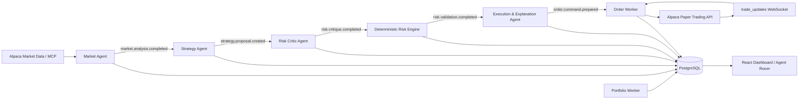

<div align="center">


# ZikosoftTrader AI

### Risk-Governed Multi-Agent AI Trading for Alpaca Paper Options

**Built for the Alpaca AI Trading Agents Hackathon**

[GitHub Repository](https://github.com/zikosoft/zikosoft-trader-ai)

</div>

---

## Overview

**ZikosoftTrader AI** is a multi-agent trading platform designed around one core principle:

> **AI can analyze, propose and explain — but it must not bypass deterministic risk controls.**

The platform combines **Alpaca market data and Paper Trading**, the **official Alpaca MCP server**, **Claude-powered agents**, deterministic trading strategies, an event-driven risk pipeline, options contract selection, portfolio monitoring, historical replay, and a visual **Agent Room** that makes the decision process inspectable.

The current hackathon trading path is deliberately **Paper-only**. There is no configuration path that switches order execution to live-money trading.

For directional signals, the options workflow selects a conservative **single-leg long call or put**, validates the contract and premium through deterministic controls, and only then allows the dedicated Order Worker to submit an order to Alpaca Paper.

---

## What the Application Does

ZikosoftTrader AI provides an end-to-end environment for experimenting with AI-assisted trading decisions while keeping execution bounded by explicit technical controls.

### Core capabilities

- Connect an **Alpaca Paper Trading** account.
- Encrypt Alpaca credentials before storing them.
- Read market data through the **Alpaca MCP server**.
- Monitor active strategy symbols and required candle timeframes.
- Collect market clock, stock snapshots, OHLCV bars, news and options evidence.
- Run **AI and deterministic strategies** side by side.
- Convert directional BUY/SELL signals into eligible long option candidates.
- Select option contracts using deterministic liquidity, DTE, spread and premium rules.
- Run a separate **AI Risk Critic** for consultative review.
- Enforce the final decision through a **non-AI deterministic Risk Engine**.
- Generate novice and expert explanations of the decision chain.
- Submit approved option orders through a single dedicated **Order Worker**.
- Track Alpaca `trade_updates` over WebSocket and reconcile order state.
- Persist portfolio and position snapshots.
- Visualize market activity, decisions, orders, portfolio state and agent activity.
- Inspect the complete multi-agent discussion in the **Agent Room**.
- Ask **Ask Ziko** questions about a selected decision without giving it trading authority.
- Activate a global **trading kill switch**.
- Disable all Claude calls independently through an **AI governance switch**.
- Enforce daily AI call and dollar-budget limits.
- Run a deterministic **Historical Replay** workspace for demonstrations and analysis.
- Check **Paper Demo Readiness** before presenting or activating a Paper strategy.
- Monitor platform health, incidents and recoveries.
- Enable optional Prometheus, Loki and Grafana observability.
- Use the UI in **English, French, Spanish, Portuguese or German**.

---

## Multi-Agent Decision Pipeline

The main trading pipeline is event-driven. Agents communicate through **Redis Streams** using structured event envelopes rather than directly calling each other.



### Why this separation matters

The architecture intentionally prevents a language model from becoming the final authority over order execution.

- AI agents can **analyze**.
- AI agents can **propose**.
- AI agents can **criticize**.
- AI agents can **explain**.
- The **Risk Engine** decides whether a proposal is acceptable.
- The **Order Worker** is the only component allowed to write orders to Alpaca.

This keeps the reasoning layer flexible while the execution boundary remains deterministic and auditable.

---

## Agents

### 1. Market Agent

The Market Agent is the read-only market intelligence layer.

It:

- Maintains an Alpaca **MCP session** for connected Paper accounts.
- Uses the official `alpaca-mcp-server` integration.
- Collects market clock data, snapshots, OHLCV bars, news and options evidence.
- Dynamically follows symbols and timeframes required by active strategies.
- Persists market bars and quotes for charts and later inspection.
- Rejects stale evidence.
- Publishes normalized `market.analysis.completed` events.
- Can optionally create a low-stakes Claude market summary.

The Market Agent does **not** place orders.

---

### 2. Strategy Agent

The Strategy Agent consumes normalized market evidence and evaluates every active strategy that is due to run.

It:

- Loads strategy definitions dynamically from the strategy registry.
- Supports both deterministic engines and Claude-powered engines.
- Validates structured strategy outputs before persistence.
- Prevents duplicate proposals for the same strategy/candle window.
- Produces BUY, SELL or HOLD proposals.
- Adds recent market evidence for downstream risk analysis.
- For directional signals, performs deterministic option contract discovery and selection.
- Writes its activity into the Agent Room.
- Publishes `strategy.proposal.created` events.

If an AI strategy is unavailable, over budget or invalid, the safety fallback is **HOLD**, not a fabricated signal.

---

### 3. Risk Critic Agent

The Risk Critic is an **AI consultative layer**, not the final risk authority.

It examines factors such as:

- Recent volatility.
- Confidence and data freshness.
- Strategy concentration signals.
- Contradictions with recent strategy proposals.
- Available context around the proposed trade.

It produces one of the following recommendations:

- `APPROVE`
- `REDUCE`
- `REQUIRES_REVIEW`
- `REJECT`

Its opinion is recorded and shown in the Agent Room, but **it cannot authorize an Alpaca order** and cannot bypass the deterministic Risk Engine.

---

### 4. Execution & Explanation Agent

This agent runs **after** the deterministic Risk Engine has made its decision.

It:

- Explains the already-decided result in natural language.
- Produces both novice-oriented and expert-oriented explanations.
- Never changes the Risk Engine outcome.
- Never relaxes a rejected control.
- Creates a strict order command only when the risk decision allows it.
- Propagates the validated option instrument and its sizing information.

For an approved option decision, it prepares the command consumed by the Order Worker.

---

## Ask Ziko

**Ask Ziko** is a read-only decision explainer inside the Agent Room.

A user can select a completed decision and ask a short question such as:

- Why did the strategy choose this direction?
- Which risk control blocked the trade?
- Why was this option contract selected?
- What did the Risk Critic disagree with?

Ask Ziko re-reads the persisted decision chain on the server. It has **no Alpaca order access, no MCP trading access and no ability to modify, cancel or create a trade**.

When Claude is unavailable or the AI budget is exhausted, it falls back to a local explanation of the persisted decision record.

---

## Trading Strategies

The strategy registry currently ships with three built-in strategies.

### AI Market Agent Strategy

A Claude-powered qualitative strategy that analyzes recent market evidence and returns:

- `BUY`, `SELL` or `HOLD`
- Confidence in basis points (`0-10000`)
- Natural-language reasoning
- Risk flags

Configurable parameters include:

- Candle timeframe
- Analysis frequency
- Risk posture
- Minimum confidence
- Maximum notional context
- Human-approval requirement

Important protections:

- Output is schema validated.
- A low-confidence directional signal is downgraded to **HOLD**.
- Human approval can be required explicitly.
- Provider failure, invalid output or exhausted AI allowance falls back to **HOLD**.

### Moving Average Crossover

A fully deterministic SMA crossover strategy.

- BUY when the short moving average crosses above the long moving average.
- SELL when the short moving average crosses below the long moving average.
- HOLD otherwise.
- Configurable timeframe, short/long periods, stop loss and take profit.
- No AI call is required.

### RSI Reversal

A fully deterministic Relative Strength Index strategy.

- BUY when RSI reaches the configured oversold zone.
- SELL when RSI reaches the configured overbought zone.
- HOLD otherwise.
- Configurable timeframe, RSI period, thresholds, stop loss and take profit.
- No AI call is required.

### Supported strategy timeframes

- `1Min`
- `5Min`
- `15Min`
- `1Hour`
- `1Day`

The application limits the V1 strategy surface to a maximum of **3 active strategies** and **10 cumulative monitored symbols** per execution context.

---

## Options Trading Flow

The hackathon options path is intentionally conservative and deterministic after the strategy signal.

### Direction mapping

- `BUY` -> long **Call** candidate
- `SELL` -> long **Put** candidate
- `HOLD` -> no option order

### Contract selection

The selector filters and ranks option contracts using:

- Expiration window / DTE.
- Tradable and active contract status.
- Bid/ask validity.
- Maximum bid/ask spread.
- Maximum premium budget.
- Maximum number of contracts.
- Strike proximity to the underlying price.
- Delta proximity when available.
- Open interest as an additional ranking signal.

The selected order is a **single-leg long option**. The platform does not create naked short options or multi-leg spreads in this hackathon version.

Default Paper demo controls are configurable through environment variables and currently include conservative limits for:

- Maximum premium per order.
- Maximum contract quantity.
- Maximum spread percentage.
- Minimum and maximum DTE.

The deterministic Risk Engine revalidates the selected instrument before execution, including call/put direction, DTE, quantity, spread, premium, maximum loss and available Paper buying power when a current portfolio snapshot is available.

---

## Deterministic Risk Engine

The **Risk Engine is deliberately not an AI agent**.

It is the hard control boundary of the application and consumes the Risk Critic's recommendation as one input among many — never as an instruction that can bypass controls.

Controls include:

- Global trading kill switch.
- Allowed execution context (`PAPER` / `REPLAY`).
- Connected Paper account status.
- Active strategy status.
- Market-data freshness.
- Strategy/account limits.
- Required strategy protections.
- Duplicate-decision protection.
- Per-strategy cooldown.
- Human-approval policy.
- Option instrument validation.
- Option DTE limits.
- Option quantity limits.
- Option spread limits.
- Maximum premium / maximum-loss checks.
- Paper buying-power validation when available.

A control that cannot be verified is not silently treated as safe. The system can return `REQUIRES_APPROVAL` rather than manufacturing missing evidence.

The kill switch is an absolute veto.

---

## Order Execution

The **Order Worker** is the only application component authorized to send order-writing requests to Alpaca.

Before any order submission it independently verifies:

1. The order-command contract.
2. That the persisted Risk Engine decision is `APPROVED`.
3. That the execution context is allowed.
4. That the trading kill switch is not engaged.
5. Idempotency and duplicate-order protection.

### Paper-only execution boundary

The trading client is locked to the Alpaca **Paper API**. The project does not expose a runtime switch to a live-money Alpaca endpoint.

### Idempotency

Order execution uses stable identifiers based on the risk decision:

- Deterministic `idempotency_key`
- Deterministic Alpaca `client_order_id`
- Database unique constraints
- Alpaca-side client-order deduplication

This is designed to reduce duplicate execution risk across retries and worker restarts.

### Order updates

A dedicated WebSocket listener consumes Alpaca `trade_updates`, including partial fills and status transitions. After reconnection, the worker can reconcile non-terminal orders through the REST API.

---

## Historical Replay

The application includes a separate **Replay** execution context for deterministic demonstrations without broker writes.

Replay features include:

- Fixed local dataset loaded from disk.
- Dataset metadata and checksum validation.
- Server-side replay position persisted in Redis.
- Reset and step-forward controls.
- Read-only synthetic options-path preview.
- Strict isolation from the Paper context.

The Replay options preview is intentionally non-transactional: it does not create a broker order.

---

## Agent Room

The **Agent Room** makes the decision pipeline visible instead of hiding it behind a single “AI says BUY” result.

It provides:

- Live agent activity.
- Strategy proposals.
- Risk Critic opinions.
- Deterministic Risk Engine decisions.
- Execution explanations.
- Decision details.
- Ask Ziko decision Q&A.
- Compact, docked and full-screen interaction modes.

The room is designed to make the system's reasoning **inspectable and auditable** during a demo.

---

## Dashboard & User Experience

The React application includes dedicated areas for:

- **Overview** — account and activity summary.
- **Strategies** — create, configure, activate and inspect strategies.
- **Agent Room** — live multi-agent decision trace.
- **Orders** — recent order state.
- **Portfolio** — account, positions and performance history.
- **Market** — market charts and decision/order markers.
- **Replay** — historical dataset controls.
- **Alerts** — system incidents and recoveries.
- **Settings** — AI governance, demo readiness, profile and safety controls.
- **System Health** — service-level health information.

Additional UX features:

- Responsive Material UI shell.
- Collapsible navigation.
- Light and dark mode.
- Novice / intermediate / expert user profiles.
- Profile-aware strategy defaults and progressive disclosure of advanced fields.
- Five interface languages: **EN / FR / ES / PT / DE**.

---

## Portfolio & Market Analytics

A dedicated Portfolio Worker periodically reads the connected Alpaca Paper account and stores:

- Cash.
- Buying power.
- Portfolio value.
- Daily P&L.
- P&L since ZikosoftTrader AI began tracking the account.
- Open-position snapshots.

The Market Agent persists OHLCV bars and quotes used by the UI for analytics.

The frontend uses charting components for:

- Candlesticks.
- Portfolio curve.
- Allocation.
- Exposure.
- Strategy activity.
- Sparklines.
- Order and decision markers.

---

## AI Governance & Cost Controls

Claude access is governed centrally rather than being called freely from every agent.

The project supports:

- Global AI on/off switch.
- Calls-per-minute limit.
- Calls-per-day limit.
- Daily dollar budget.
- Non-editable server-side hard budget ceiling.
- Configurable model tiers.
- Token limits and request timeout.
- Atomic Redis reservation of estimated request cost before provider calls.
- Safe deterministic fallbacks when AI is unavailable.

The default configuration separates higher-stakes and lower-stakes model usage through the shared `AIProvider` abstraction.

No browser endpoint exposes the configured Anthropic API key, raw system prompts or raw provider responses.

---

## Security & Safety Design

This repository includes several safeguards relevant to a publicly demonstrated trading application:

- **Paper Trading only** for broker writes.
- Alpaca secrets encrypted at rest with **Fernet authenticated encryption**.
- `.env` and secret files excluded from Git.
- PBKDF2-HMAC-SHA256 password hashing.
- Opaque session tokens stored server-side only as hashes.
- Login rate limiting.
- Read-only separation for market-data/MCP access.
- Single dedicated order-writing boundary.
- Deterministic Risk Engine.
- Absolute trading kill switch.
- Independent AI kill switch.
- AI budget hard cap.
- Structured Pydantic validation between pipeline stages.
- Redis Streams consumer groups, retry handling and dead-letter routing.
- Order idempotency across retries.
- Paper demo preflight checks.
- Service heartbeat monitoring and incident alerts.
- Strict separation between Replay and Paper contexts.

> **Never commit a real `.env` file or API credentials.** Copy `.env.example` and configure secrets only in the deployment environment.

---

## Paper Demo Readiness

The Settings area contains a **Paper Demo Readiness** preflight designed for the hackathon walkthrough.

It checks the existing server-side configuration for items such as:

- Connected encrypted Alpaca Paper account.
- Locked Paper endpoint.
- MCP session health.
- Option-contract catalogue readiness.
- Trading kill-switch state.

Its optional broker connectivity check performs a **read-only account request**. It does not accept credentials from the browser and cannot place, modify or cancel an order.

---

## System Health, Alerts & Observability

A Watchdog monitors essential services and records health-state transitions.

The platform includes:

- PostgreSQL health checks.
- Redis health checks.
- Application heartbeats.
- Service transition history.
- Incident/recovery alerts.
- Global health indicator in the UI.

Optional observability services are available through the Docker Compose `observability` profile:

- **Prometheus**
- **Loki**
- **Grafana**

---

## Technology Stack

### Frontend

| Technology | Purpose |
|---|---|
| React 18 | Application UI |
| TypeScript | Typed frontend development |
| Vite | Development/build toolchain |
| Material UI | Responsive component system |
| ECharts | Analytics visualizations |
| Lightweight Charts | Financial charting |
| React Router | Application routing |

### Backend & domain services

| Technology | Purpose |
|---|---|
| Python 3.11 | Backend, agents and workers |
| FastAPI | REST API |
| Pydantic | Runtime contracts and validation |
| SQLAlchemy | Persistence layer |
| Alembic | Database migrations |
| httpx | HTTP integrations |
| WebSockets | Alpaca trade-update stream |
| cryptography / Fernet | Secret encryption |

### AI & Alpaca

| Technology | Purpose |
|---|---|
| Anthropic Claude | AI strategy, risk critique and explanations |
| Anthropic Python SDK | Claude integration |
| Model Context Protocol SDK | MCP client integration |
| `alpaca-mcp-server` | Official Alpaca MCP server |
| Alpaca Paper Trading API | Order execution |
| Alpaca Market Data | Market evidence |
| Alpaca `trade_updates` | Order status/fill stream |
| Alpaca CLI helper | Offline strategy/backtest artefact workflow |

### Data & infrastructure

| Technology | Purpose |
|---|---|
| PostgreSQL 16 | Durable domain data and audit trail |
| Redis 7 | Event bus, runtime state, heartbeats and AI budgets |
| Redis Streams | Agent/worker event pipeline |
| Docker / Docker Compose | Reproducible multi-service deployment |
| Prometheus | Metrics / monitoring |
| Loki | Log aggregation |
| Grafana | Observability dashboard |

---

## Service Architecture

The default Docker Compose stack contains the application, data services, four agents and five deterministic workers.

```text
zikosofttrader-ai
│
├── postgres
├── redis
├── migrate                    # one-shot Alembic migration service
├── backend-api                # FastAPI
├── frontend                   # React + Vite
│
├── market-agent               # Alpaca MCP / market evidence
├── strategy-agent             # strategy evaluation + option selection
├── risk-critic-agent          # consultative AI risk review
├── execution-explanation-agent
│
├── risk-engine                # deterministic final risk authority
├── order-worker               # only Alpaca order-writing component
├── portfolio-worker           # account / position snapshots
├── alert-worker               # system alerts
└── watchdog                   # service health aggregation

Optional observability profile:
├── prometheus
├── loki
└── grafana
```

---

## Event-Driven Contracts

Important Redis Streams events include:

```text
market.analysis.completed
        ↓
strategy.proposal.created
        ↓
risk.critique.completed
        ↓
risk.validation.completed
        ↓
order.command.prepared
```

Consumer groups provide explicit acknowledgements, retry handling, stale-message reclamation and dead-letter routing.

Each decision chain is linked by correlation/causation identifiers so activity can be traced across services.

---

## Repository Structure

```text
.
├── agents/                 # 4 AI/agent services
│   ├── market_agent/
│   ├── strategy_agent/
│   ├── risk_critic_agent/
│   └── execution_explanation_agent/
│
├── backend/                # FastAPI API, models, migrations, auth
├── frontend/               # React/TypeScript application
├── strategies/             # pluggable strategy definitions + engines
├── workers/                # deterministic risk/execution/ops workers
├── shared/                 # event, AI, risk and option contracts
├── replay_data/            # fixed replay dataset
├── scripts/                # tooling, including Alpaca CLI backtest helper
├── infra/                  # Prometheus / Loki / Grafana configuration
├── tests/                  # backend, agent, strategy and worker tests
├── docker-compose.yml
├── Makefile
└── .env.example
```

---

## Quick Start

### Prerequisites

- Docker Engine / Docker Desktop with Docker Compose
- Git

For non-Docker development:

- Python **3.11**
- Node.js **20**

### 1. Clone the repository

```bash
git clone https://github.com/zikosoft/zikosoft-trader-ai.git
cd zikosoft-trader-ai
```

### 2. Create the local environment file

```bash
cp .env.example .env
```

Generate a Fernet key for `APP_ENCRYPTION_KEY`:

```bash
python -c "from cryptography.fernet import Fernet; print(Fernet.generate_key().decode())"
```

Then configure the values required for your environment.

**Do not commit `.env`.**

### 3. Start the core stack

```bash
docker compose up -d --build
```

or:

```bash
make up-core
```

The migration container automatically runs:

```bash
alembic upgrade head
```

before dependent application services start.

### 4. Open the application

```text
Frontend:  http://localhost:5173
Backend:   http://localhost:8000
API docs:  http://localhost:8000/docs
```

### 5. Optional observability stack

```bash
docker compose --profile observability up -d --build
```

or:

```bash
make up
```

Default local ports:

```text
Grafana:     http://localhost:3000
Prometheus:  http://localhost:9090
Loki:        http://localhost:3100
```

---

## Alpaca Paper Setup

The application is designed to store Alpaca Paper credentials through the authenticated UI rather than hard-coding them in source code.

Relevant server configuration includes:

```text
ALPACA_PAPER_BASE_URL
ALPACA_DATA_BASE_URL
ALPACA_PAPER_STREAM_URL
APP_ENCRYPTION_KEY
```

The Paper endpoint is intentionally fixed to Alpaca's Paper environment for the executable trading path.

---

## Claude Configuration

The AI layer is configured through environment variables such as:

```text
AI_PROVIDER
ANTHROPIC_API_KEY
AI_MODEL_HIGH_STAKES
AI_MODEL_LOW_STAKES
AI_MAX_CALLS_PER_MINUTE
AI_MAX_CALLS_PER_DAY
AI_DAILY_BUDGET_USD
AI_DAILY_BUDGET_HARD_CAP_USD
AI_CALLS_ENABLED
```

The application can continue operating with deterministic strategies and safe fallbacks when Claude is disabled or unavailable.

---

## Option Risk Configuration

Server-side Paper option limits are configurable without changing the application code:

```text
OPTIONS_MAX_PREMIUM_PER_ORDER
OPTIONS_MAX_CONTRACTS
OPTIONS_MAX_SPREAD_PCT
OPTIONS_MIN_DTE
OPTIONS_MAX_DTE
```

These are independent of the Claude cost limits.

---

## Testing

The repository contains broad automated coverage across authentication, contexts, market data, strategies, MCP session handling, AI provider behavior, option normalization/selection, risk controls, order execution, portfolio updates, replay, alerts and system health.

At the current project state the repository contains **50 test modules** and **67 explicitly defined test functions**.

Run the standard suite with:

```bash
make test
```

Agent/worker-focused tests can be run from their separate environment with:

```bash
make test-agents
```

The project intentionally keeps backend and agent Python dependency environments separate because the MCP/agent dependency tree has different Starlette/Pydantic constraints from the FastAPI backend image.

---

## Alpaca CLI Backtest Helper

The repository also contains:

```text
scripts/alpaca_cli_backtest.py
```

This helper can replay the same deterministic strategy engines used by the application against candle data exported with the Alpaca CLI, and compare the strategy result with a buy-and-hold benchmark.

Example:

```bash
python scripts/alpaca_cli_backtest.py \
  --input aapl_2025.csv \
  --strategy moving_average_crossover \
  --symbol AAPL
```

This keeps the backtest logic tied to the same strategy implementation used by the runtime rather than maintaining a separate copy of the trading logic.

---

## Deployment Notes

For a public hackathon deployment:

- Keep `.env` only on the server.
- Never publish Alpaca or Anthropic credentials.
- Put the application behind HTTPS and a reverse proxy.
- Expose only the required web ports publicly.
- Do not expose PostgreSQL or Redis directly to the Internet.
- Keep the Alpaca endpoint locked to Paper Trading.
- Set conservative AI and option budgets before sharing the demo URL.
- Verify the **Paper Demo Readiness** card before judging/demo sessions.

---

## Design Principles

### AI is not the risk engine

The most important architectural decision is the separation between probabilistic AI reasoning and deterministic execution controls.

### Fail closed when evidence is missing

Missing or unverifiable evidence does not become an automatic approval.

### No fabricated AI signal

If the AI provider cannot produce a valid response, the trading strategy falls back to HOLD.

### One order-writing boundary

Only the Order Worker owns Alpaca order-writing capability.

### Paper-first safety

The hackathon version is intentionally restricted to Paper Trading.

### Explainability is part of the product

The Agent Room, decision details and Ask Ziko make the complete decision chain visible to the user.

---

## Current Hackathon Scope

The implementation focuses on demonstrating a robust architecture for **AI-assisted, risk-governed options trading in Alpaca Paper**.

The options path currently uses:

- Directional long calls and long puts.
- Single-leg limit orders.
- Conservative contract selection.
- Deterministic pre-trade controls.
- Paper account buying-power checks.
- Idempotent execution.
- Broker order-state reconciliation.

Out of scope for this hackathon version:

- Real-money/live trading.
- Naked short options.
- Multi-leg option spreads.
- Unbounded autonomous trading.

---

## Disclaimer

ZikosoftTrader AI is a software demonstration and research/hackathon project. It is **not financial advice** and is not intended to recommend securities, investment strategies or real-money trades.

The executable broker integration in this repository is designed for **Alpaca Paper Trading**.

---

## License

This project is distributed under the **MIT License**. See [`LICENSE`](./LICENSE).

---

<div align="center">

**ZikosoftTrader AI — AI proposes. Deterministic risk controls decide. Paper execution stays bounded.**

</div>
